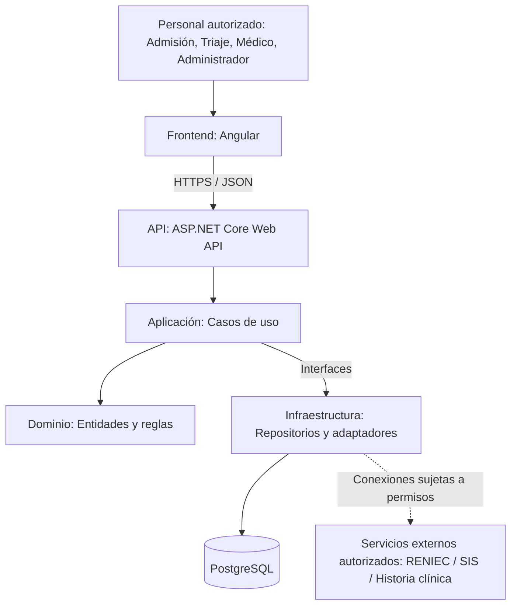
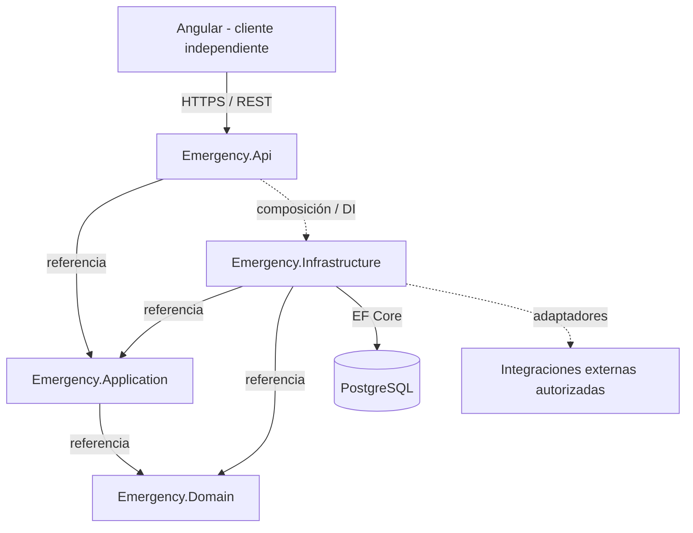
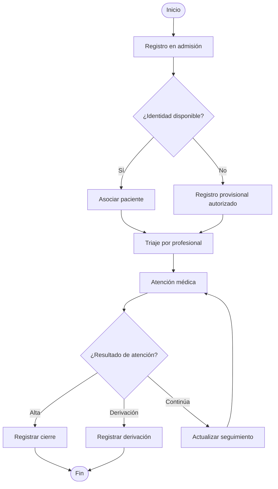

# ENTREGABLE 03: ESTILO ARQUITECTÓNICO + ENFOQUE ARQUITECTÓNICO

**Universidad:** Universidad Nacional de San Cristóbal de Huamanga (UNSCH)  
**Escuela profesional:** Ingeniería de Sistemas  
**Asignatura:** Laboratorio de Arquitectura de Software  
**Estudiante:** Ronex Pozo Sarmiento  
**Proyecto:** Sistema Web para la Gestión de Atención de Emergencias del Hospital Regional de Ayacucho  
**Fecha:** Octubre de 2026

---

## 1. Resumen de la propuesta

El proyecto propone un sistema web de apoyo a la atención de emergencias para gestionar el ingreso de pacientes, el triaje, la atención médica y la trazabilidad del proceso. Se pretende reducir la fragmentación de la información y mejorar la coordinación entre el personal administrativo y asistencial. La propuesta no sustituye el juicio clínico ni debe obstaculizar la atención inmediata cuando no se dispone de DNI, conectividad o validación del seguro.

Se selecciona el **estilo arquitectónico en capas**, complementado por un enfoque de **Clean Architecture** dentro del backend. El frontend se desarrollará en **Angular**, el backend en **ASP.NET Core Web API** y la base de datos en **PostgreSQL**. Para las conexiones con terceros se contemplan adaptadores aislados que se implementarán únicamente cuando existan convenios, autorizaciones y mecanismos de acceso adecuados.

## 2. Contexto y problema

La atención de emergencias exige registrar y consultar información de forma rápida, segura y trazable. En un proceso no integrado pueden producirse duplicidades de registro, demoras al ubicar datos y dificultades para conocer el estado de cada atención. El sistema propuesto centraliza tareas operativas, define responsabilidades por rol y facilita el seguimiento de cada caso desde la admisión hasta su cierre o derivación.

**Actores principales:** personal de admisión, profesional de triaje, médico de emergencia, administrador y paciente (como sujeto de la atención). Las operaciones clínicas deben estar reservadas a personal habilitado.

## 3. Objetivos arquitectónicos

1. Separar la interfaz, las reglas de negocio, el acceso a datos y las integraciones externas.
2. Permitir cambios tecnológicos sin reescribir las reglas principales del proceso de emergencia.
3. Proteger información sensible mediante autenticación, autorización por roles, cifrado de transporte y auditoría.
4. Mantener operativos los procesos críticos cuando servicios externos no estén disponibles, mediante flujos de contingencia autorizados.
5. Facilitar mantenimiento, pruebas y evolución gradual del producto.

## 4. Estilo arquitectónico elegido: Arquitectura en capas

### 4.1. Definición

La **arquitectura en capas** distribuye el sistema en niveles con responsabilidades diferenciadas y contratos explícitos. Para esta propuesta se emplea como estilo estructural dominante y se adapta a una aplicación web cliente-servidor. La separación ayuda a limitar el acoplamiento entre interfaz, casos de uso, dominio e infraestructura.

### 4.2. Capas y responsabilidades

| Capa | Tecnología o componente propuesto | Responsabilidad |
|---|---|---|
| Presentación | Angular + TypeScript | Vistas para admisión, triaje, atención médica, consulta de pacientes y administración; validaciones de experiencia de usuario. |
| API | ASP.NET Core Web API | Endpoints REST, validación de solicitudes, autenticación/autorización y manejo de errores. |
| Aplicación | Casos de uso de .NET | Orquestar registro de emergencia, clasificación, asignación y cierre de atenciones. |
| Dominio | Entidades, reglas e interfaces de dominio | Modelar pacientes, emergencias, triaje, atención y transiciones válidas de estado. |
| Infraestructura | EF Core, repositorios y adaptadores | Implementar persistencia, auditoría, mensajería y conexión autorizada con servicios externos. |
| Persistencia | PostgreSQL | Almacenar información transaccional y registros de auditoría según el modelo aprobado. |

**Nota:** La API es un límite de entrada, mientras que Aplicación y Dominio expresan responsabilidades lógicas. Aunque se visualicen como niveles, Clean Architecture determina **hacia dónde apuntan las dependencias del código**, no el orden físico de ejecución.

### 4.3. Vista general

La figura expresa el **flujo lógico de colaboración**, no el grafo de referencias entre proyectos del backend. El grafo de dependencias se presenta en la sección 5.

### 4.4. Justificación frente a alternativas

- **Microservicios:** podrían permitir despliegues independientes en etapas avanzadas, pero introducen complejidad de red, observabilidad, consistencia de datos y operación. No se justifican aún para el alcance académico inicial.
- **Arquitectura monolítica sin separación interna:** simplifica el inicio, pero tiende a acoplar interfaz, datos y reglas si no se aplican límites claros.
- **Estilo por capas (elegido):** ofrece organización, trazabilidad de responsabilidades y una adopción gradual acorde al tamaño previsto.

La implementación inicial será un **backend monolítico modular**: una sola API desplegable con módulos lógicos separados, no un conjunto de microservicios.

## 5. Enfoque arquitectónico elegido: Clean Architecture

### 5.1. Definición

**Clean Architecture** es un enfoque de organización interna basado en separación de responsabilidades e inversión de dependencias. Las políticas y reglas centrales del negocio no deben depender de detalles técnicos como Angular, Entity Framework Core, PostgreSQL o un proveedor externo.

### 5.2. Organización del backend

| Proyecto o módulo lógico | Contenido | Referencias permitidas |
|---|---|---|
| `Emergency.Domain` | Entidades, invariantes, valores y reglas puras | Ningún proyecto de infraestructura o interfaz. |
| `Emergency.Application` | Casos de uso, DTO, interfaces de repositorio e integración | `Emergency.Domain`. |
| `Emergency.Infrastructure` | EF Core, repositorios PostgreSQL, adaptadores y proveedores externos | `Emergency.Application` y `Emergency.Domain`. |
| `Emergency.Api` | Controladores/endpoints, configuración y composición de dependencias | `Emergency.Application`; registra implementaciones de `Emergency.Infrastructure` mediante inyección de dependencias. |

El frontend `Angular` es una aplicación separada que se comunica mediante HTTPS y API REST. No referencia directamente ninguno de los proyectos .NET.

### 5.3. Reglas de dependencia

**Diferencia importante:** durante la ejecución un caso de uso puede invocar un repositorio mediante una interfaz, pero **el proyecto Application no debe referenciar Infrastructure**. Infrastructure implementa interfaces definidas por el núcleo.

### 5.4. Ejemplo del caso de uso: registrar una emergencia

1. El personal de admisión registra una emergencia desde Angular, con los datos disponibles.
2. La API valida el formato y los permisos del usuario.
3. `RegistrarEmergencia` aplica las reglas del caso de uso y solicita el registro mediante `IEmergenciaRepository`.
4. La infraestructura implementa el repositorio con Entity Framework Core y PostgreSQL.
5. Se registra un evento de auditoría con fecha, usuario y acción.
6. La API devuelve el identificador y el estado del registro al frontend.

Si no puede validarse temporalmente la identidad o el seguro, el sistema debe permitir, bajo reglas institucionales, **registro provisional y conciliación posterior**, evitando condicionar la atención médica a una integración externa.

## 6. Componentes y módulos funcionales

| Módulo | Funciones iniciales |
|---|---|
| Identidad y acceso | Inicio de sesión, cierre de sesión, roles y permisos. |
| Pacientes y admisión | Registro, búsqueda, identificador provisional y actualización de datos. |
| Emergencias | Apertura, estado, prioridad operativa, seguimiento y cierre o derivación. |
| Triaje | Registro de evaluación y clasificación, únicamente por personal autorizado y según protocolo institucional. |
| Atención médica | Notas de atención, diagnósticos y órdenes en el alcance que autorice la institución. |
| Interoperabilidad | Adaptadores a RENIEC, SIS y servicios de historia clínica, sujetos a habilitación. |
| Auditoría y reportes | Registro de accesos y operaciones, consultas operativas y reportes. |

## 7. Integraciones externas

**RENIEC:** futura consulta de datos de identidad, solo por canales y permisos institucionales correspondientes.  
**SIS u otros seguros:** futura consulta de afiliación/cobertura, de acuerdo con las interfaces habilitadas.  
**Servicios de historia clínica:** interoperabilidad eventual, conforme a las normas de confidencialidad, autorización y formatos que correspondan.  
**Notificaciones:** servicio desacoplado para avisos operativos permitidos, sin divulgar datos clínicos sensibles en mensajes inseguros.

Se propone que todas las llamadas externas se gestionen **desde Infrastructure**, nunca directamente desde Angular. Las caídas o lentitud de terceros requieren tiempos de espera, manejo de errores y alternativas operativas; su disponibilidad no debe impedir el registro de una urgencia.

## 8. Atributos de calidad y estrategias

| Atributo | Escenario o necesidad | Respuesta arquitectónica propuesta |
|---|---|---|
| Seguridad | Un usuario intenta consultar una historia clínica sin permiso. | Autorización por roles y políticas en cada endpoint; auditoría de acceso. |
| Disponibilidad | RENIEC o SIS no responde. | Aislar la integración, establecer timeout y permitir el procedimiento provisional autorizado. |
| Mantenibilidad | Cambia el proveedor de almacenamiento. | Interfaces de repositorio y adaptadores externos a Application/Domain. |
| Trazabilidad | Se modifica el estado de una emergencia. | Auditoría de usuario, instante, operación y resultado. |
| Rendimiento | Hay múltiples solicitudes concurrentes. | Consultas indexadas, paginación y pruebas de carga antes de fijar objetivos cuantitativos. |
| Testabilidad | Se cambia una regla de triaje o admisión. | Pruebas unitarias de casos de uso y dominio con dobles de repositorios. |

**Alcance de los indicadores:** las metas de tiempos de respuesta, capacidad, recuperación y disponibilidad deben definirse con el hospital y validarse mediante pruebas; no se asumen cifras no medidas.

## 9. Diagrama resumido del flujo de emergencia

Este flujo es conceptual y deberá ajustarse al protocolo real del Hospital Regional de Ayacucho. La evaluación clínica y la priorización no las realiza automáticamente el sistema.

## 10. Decisiones, consecuencias y riesgos

**Decisión 1 — Arquitectura en capas / monolito modular.** Se priorizan simplicidad inicial, separación de responsabilidades y facilidad de despliegue. Como consecuencia, se requiere disciplina de límites internos para evitar acoplamiento entre módulos.

**Decisión 2 — Clean Architecture en el backend.** Se busca proteger reglas de negocio de proveedores y detalles de persistencia. Como consecuencia, habrá más interfaces y proyectos que en un CRUD mínimo, pero se facilitarán las pruebas y la evolución.

**Riesgos:** ausencia de permisos para integraciones; disponibilidad de conectividad; calidad y duplicidad de datos; protección de información clínica; ambigüedad de reglas operativas; adopción del personal. La mitigación inicial incluye adaptadores simulados para desarrollo, registro provisional, control de acceso, auditoría y validación participativa de flujos.

## 11. Tecnologías propuestas

- **Frontend:** Angular, TypeScript, HTML y CSS.
- **Backend:** ASP.NET Core Web API (C#).
- **Persistencia:** PostgreSQL mediante Entity Framework Core y su proveedor compatible.
- **API:** REST sobre HTTPS y mensajes JSON.
- **Autenticación/autorización:** mecanismo institucional por definir; JWT y control de roles como propuesta para la API.
- **Herramientas de desarrollo:** Visual Studio Code, Git y pruebas automatizadas.

## 12. Conclusión

Para el entregable académico se recomienda **arquitectura en capas como estilo estructural**, **Clean Architecture como enfoque de diseño del backend** y **despliegue inicial como monolito modular**. Esta combinación ofrece una estructura comprensible, testeable y preparada para cambios, sin incorporar de forma prematura la complejidad operativa de los microservicios. El diseño queda condicionado a la validación del flujo hospitalario, la definición de requerimientos reales y la factibilidad técnica y legal de las integraciones.

## 13. Anexos

- [`01-arquitectura-en-capas.mmd`](diagramas/01-arquitectura-en-capas.mmd)
- [`02-clean-architecture.mmd`](diagramas/02-clean-architecture.mmd)
- [`03-flujo-emergencia.mmd`](diagramas/03-flujo-emergencia.mmd)
- [`ADR-001-estilo-en-capas.md`](decisiones/ADR-001-estilo-en-capas.md)
- [`ADR-002-enfoque-clean-architecture.md`](decisiones/ADR-002-enfoque-clean-architecture.md)
